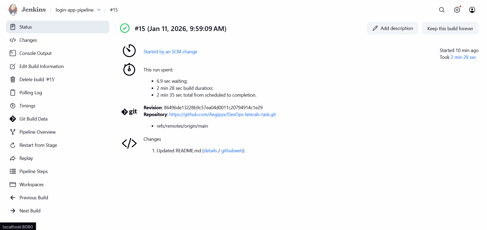
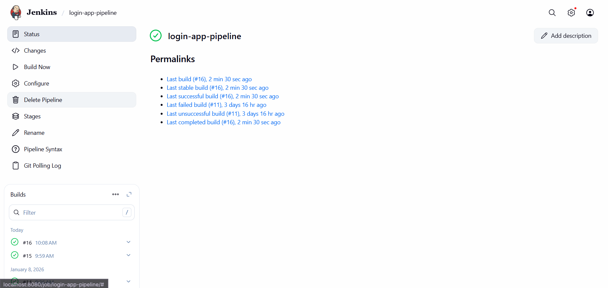
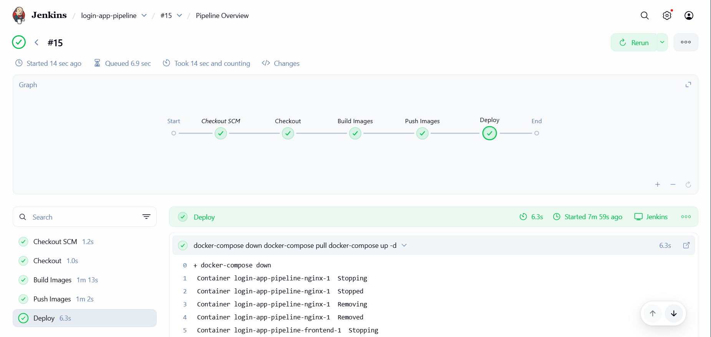
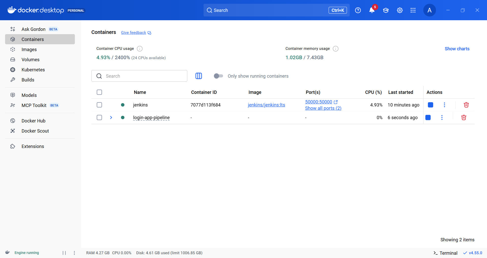
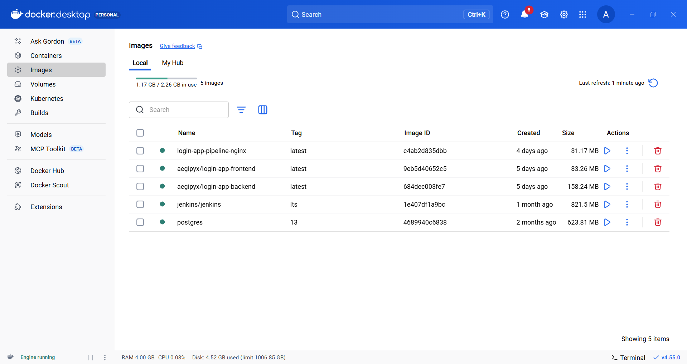
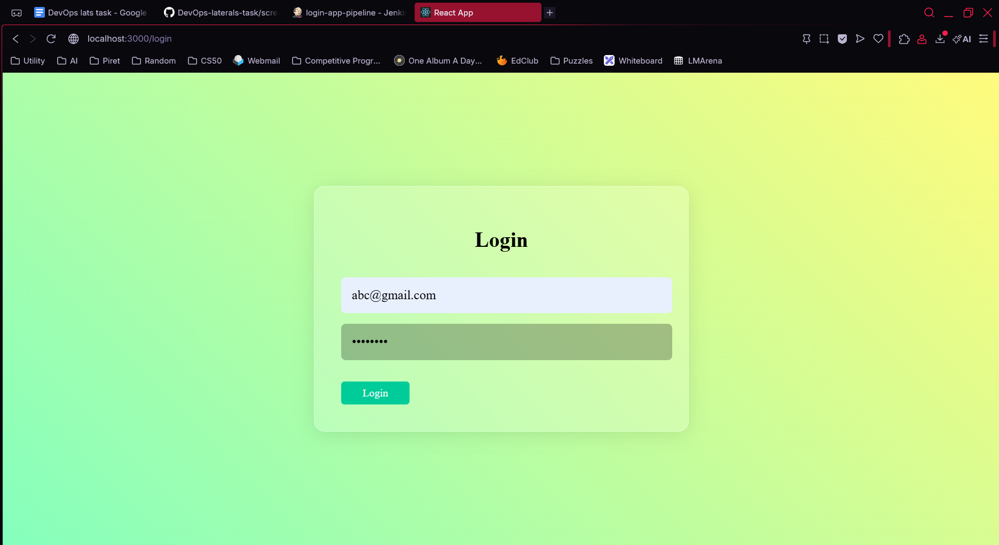
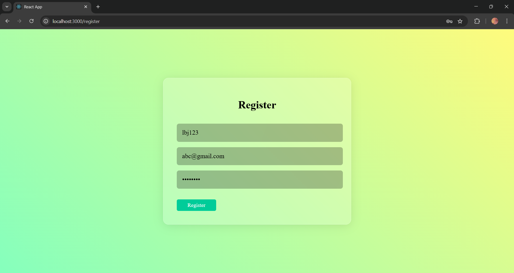
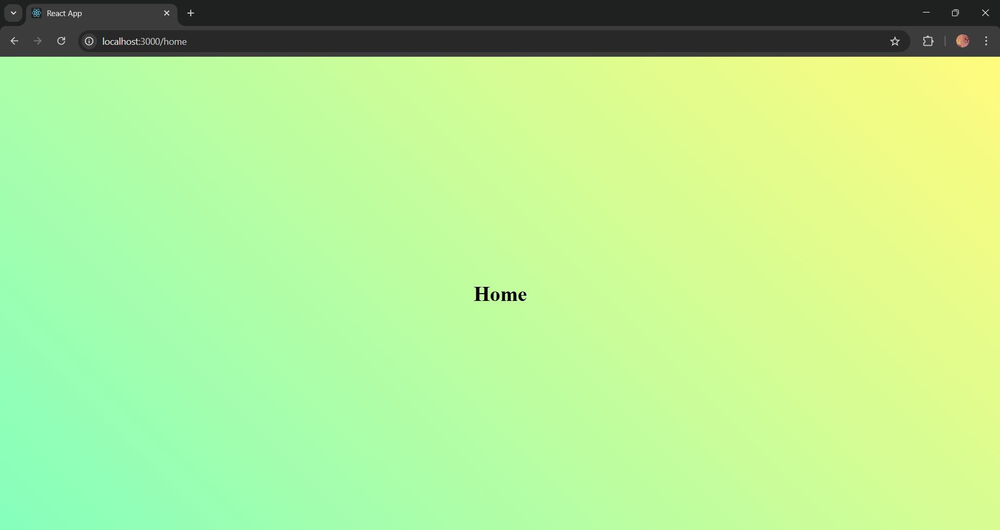

# DevOps Laterals Task – Login Application

**Level 1 and Level 2 - Complete**

## Architecture

- **Frontend**  
  React application served via an Nginx container.

- **Backend**  
  Rust (Actix Web) API server handling authentication logic and database access.

- **Database**  
  PostgreSQL for storing user credentials.

- **Reverse Proxy (Nginx)**  
  Acts as the single public entry point, routing:
  - `/` requests to the frontend service  
  - `/api/*` requests to the backend service  

All services run in an isolated Docker network, with **only Nginx exposed publicly**.

## Containerization (Level 1)

- Each component (frontend, backend, nginx) is fully containerized using Docker.
- PostgreSQL uses an official image with a named volume.
- Nginx configuration is **baked into a custom image** instead of runtime volume mounts to ensure:
  - Reproducible deployments
  - CI/CD compatibility
  - No dependency on host filesystem paths

## Reverse Proxy & Networking

- Nginx serves as a **reverse proxy** and the only exposed service.
- Internal services (frontend, backend, database) are not directly accessible from the host.
- This improves security by preventing direct access to internal services.

## CI/CD Automation with Jenkins (Level 2)

A Jenkins Pipeline is used to automate the entire workflow.

### Pipeline Flow

Stage 1: **Checkout**  
   Jenkins pulls the latest code from GitHub.

Stage 2: **Build Docker Images**  
   - Frontend image
   - Backend image

Stage 3: **Push to Container Registry**  
   - Images are pushed to Docker Hub.
   - Credentials are securely managed using Jenkins Credentials.

Stage 4: **Deploy**  
   - Jenkins redeploys the application using Docker Compose.
   - The Jenkins pipeline polls the Github repo every 5 minutes and automatically trigger a rebuild and redeployment when changes are detected.

## Container Registry

- Docker Hub is used as the container registry.
- Application images are versioned and pushed automatically by Jenkins.
- Deployment uses registry images.

## Technologies Used

- Docker & Docker Compose  
- Jenkins 
- Nginx  
- PostgreSQL  
- Rust (Actix Web)  
- React  

## Screenshots & Logs

### Jenkins Pipeline Success




**Pipeline Deploy Stage Logs**
```
+ docker-compose down
 Container login-app-pipeline-nginx-1  Stopping
 Container login-app-pipeline-nginx-1  Stopped
 Container login-app-pipeline-nginx-1  Removing
 Container login-app-pipeline-nginx-1  Removed
 Container login-app-pipeline-frontend-1  Stopping
 Container login-app-pipeline-frontend-1  Stopped
 Container login-app-pipeline-frontend-1  Removing
 Container login-app-pipeline-frontend-1  Removed
 Container login-app-pipeline-backend-1  Stopping
 Container login-app-pipeline-backend-1  Stopped
 Container login-app-pipeline-backend-1  Removing
 Container login-app-pipeline-backend-1  Removed
 Container login-app-pipeline-db-1  Stopping
 Container login-app-pipeline-db-1  Stopped
 Container login-app-pipeline-db-1  Removing
 Container login-app-pipeline-db-1  Removed
 Network login-app-pipeline_default  Removing
 Network login-app-pipeline_default  Removed
+ docker-compose pull
 nginx Skipped - No image to be pulled 
 db Pulling 
 frontend Pulling 
 backend Pulling 
 backend Pulled 
 frontend Pulled 
 db Pulled 
+ docker-compose up -d
 Network login-app-pipeline_default  Creating
 Network login-app-pipeline_default  Created
 Container login-app-pipeline-db-1  Creating
 Container login-app-pipeline-db-1  Created
 Container login-app-pipeline-backend-1  Creating
 Container login-app-pipeline-backend-1  Created
 Container login-app-pipeline-frontend-1  Creating
 Container login-app-pipeline-frontend-1  Created
 Container login-app-pipeline-nginx-1  Creating
 Container login-app-pipeline-nginx-1  Created
 Container login-app-pipeline-db-1  Starting
 Container login-app-pipeline-db-1  Started
 Container login-app-pipeline-backend-1  Starting
 Container login-app-pipeline-backend-1  Started
 Container login-app-pipeline-frontend-1  Starting
 Container login-app-pipeline-frontend-1  Started
 Container login-app-pipeline-nginx-1  Starting
 Container login-app-pipeline-nginx-1  Started
```

### Docker Containers Running



### Application Running





## How to Run via Jenkins CI/CD

1. **Start Jenkins** in terminal: "docker start jenkins" (given that the jenkins container is already established and assigned to port 8080)
2. Open http://localhost:8080 and log in to Jenkins.
3. Ensure Docker Hub credentials are configured in Jenkins.
4. Open the existing pipeline job and click Build Now.
5. Once the pipeline completes successfully, open: http://localhost:3000
